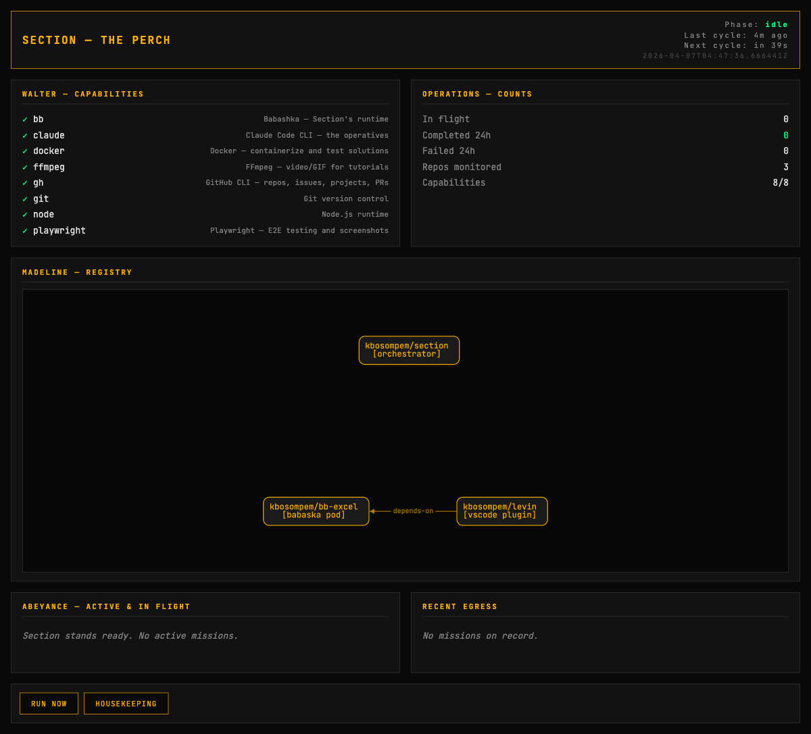

# Section

> *"There are no rules in Section — only missions."*

**Section** is a self-evolving autonomous development platform that runs on a single Mac Mini. File a GitHub issue, and an operative handles it — builds, tests, documents, and PRs the solution. Need a new capability? File an issue against Section itself.

Named after the covert organization in [*La Femme Nikita*](https://en.wikipedia.org/wiki/La_Femme_Nikita_(TV_series)) (1997–2001), because like Section One, it operates autonomously, maintains its own infrastructure, and the operatives never sleep.

## How It Works

1. **Birkoff** wakes up every 5 minutes (via macOS `launchd`)
2. **Oversight** runs recovery checks — heals broken capabilities, cleans stale locks
3. **Comm** polls your GitHub repos for issues labeled `section` and assigned to the bot
4. **Operations** dispatches missions to a pool of **Operatives** (concurrent `claude -p` sessions)
5. Each operative gets a **Briefing** — the issue, repo context, capability manifest, and memory from prior attempts
6. The operative implements the solution, commits, pushes, and opens a PR
7. **Madeline** records what happened for next time

Meanwhile, **The Perch** runs continuously, serving a web dashboard on `:8080` that shows real-time status: capabilities, active missions, recent egress, and the repo relationship graph.

## Terminology

| Term | Meaning |
|------|---------|
| **Section** | The platform — this repo |
| **Birkoff** | The orchestrator (nerve center) |
| **The Perch** | Operations' elevated view — the web dashboard on `:8080` |
| **Operatives** | Claude Code worker sessions |
| **Missions** | GitHub issues to be worked on |
| **Briefing** | The assembled prompt + context for an operative |
| **Walter** | Capability registry — he builds the gadgets |
| **Madeline** | Memory system — she knows everything |
| **Operations** | Scheduler and dispatcher — directs from The Perch |
| **The Perch** | Status view / logs |
| **Oversight** | Self-healing watchdog |
| **Comm** | GitHub / email communication layer |
| **Abeyance** | Issues queued and waiting for dispatch |
| **Sim** | Tests — run before any mission is considered complete |
| **Egress** | PR submission — the exit point of a mission |
| **Housekeeping** | Lock cleanup, log pruning, branch maintenance |

## Quick Start

### Prerequisites

- macOS (Apple Silicon Mac Mini recommended)
- [Babashka](https://github.com/babashka/babashka) (`brew install borkdude/brew/babashka`)
- [GitHub CLI](https://cli.github.com/) (`brew install gh && gh auth login`)
- [Claude Code](https://claude.ai/product/claude-code) (`npm install -g @anthropic-ai/claude-code`)

### Setup

```bash
# 1. Clone
git clone git@github.com:kbosompem/section.git ~/Sources/KB/section
cd ~/Sources/KB/section

# 2. Store your Anthropic API key in macOS Keychain
security add-generic-password -a section -s anthropic-api-key -w "YOUR_KEY_HERE"

# 3. Register the repos you want Section to monitor
bb repo add kbosompem/section --description "The forge itself" --role "orchestrator"
bb repo add kbosompem/my-app  --description "Main product"     --role "frontend"
bb repo add kbosompem/api     --description "REST API"         --role "backend"

# 4. Optionally describe how they relate to each other
bb repo link kbosompem/my-app kbosompem/api --type depends-on --note "Uses /v1 endpoints"

# 5. Test it
bb walter    # Check capabilities
bb status    # View Section status
bb test      # Run sims
bb run       # Execute one cycle

# 6. Install for continuous operation
bb install   # Installs two launchd plists:
             #   Birkoff — polls every 5 min, restarts on crash
             #   The Perch — serves the dashboard on :8080, always running

# 7. Open the dashboard
open http://localhost:8080
```

### Managing Repos

The **repo registry** (managed by Madeline, stored in `madeline/repos.edn`) is how Section knows what to monitor and how repos relate to each other. Relationship context is automatically included in every mission briefing so operatives understand the broader system.

```bash
bb repo add OWNER/NAME [--description "..."] [--role "..."]
bb repo list                                  # Show all registered repos
bb repo show OWNER/NAME                       # Details + relationships (both directions)
bb repo remove OWNER/NAME                     # Stops monitoring and cleans incoming links
bb repo link  FROM/REPO TO/REPO [--type TYPE] [--note "..."]
bb repo unlink FROM/REPO TO/REPO [--type TYPE]
bb repo help                                  # Full usage
```

**Relationship types:** `depends-on`, `used-by`, `monitors`, `deploys-to`, `tests-for`, `forks-from`, `parent-of`, `child-of`, `integrates-with`, `sibling-of`.

### The Perch (Web Dashboard)

The Perch is a live, read-only view of everything Section is doing. It runs as a separate `launchd` service and serves an HTML dashboard on port 8080.



What it shows:

- **Header** — current phase, time since last Birkoff cycle, time until next
- **Walter** — capability checkmarks, updated every 30s
- **Operations** — in-flight / completed / failed mission counts
- **Madeline** — interactive repo graph with relationship labels (pan, zoom, drag)
- **Abeyance** — missions currently being worked on by operatives
- **Recent Egress** — last 10 missions and their outcomes
- **Actions** — `RUN NOW` and `HOUSEKEEPING` buttons to trigger cycles manually

**Running it:**

```bash
bb perch          # Foreground, on :8080
bb perch 9000     # Custom port
PERCH_PORT=8888 bb perch
```

After `bb install`, The Perch runs automatically via launchd.

**Accessing from other devices:**

| Where | URL |
|---|---|
| The Mac Mini itself | `http://localhost:8080` |
| Same LAN | `http://mac-mini.local:8080` (Bonjour) |
| Remote via Tailscale | `http://mac-mini.<tailnet>.ts.net:8080` |
| Public via Cloudflare Tunnel | `https://section.yourdomain.com` |

**Recommended for remote access: Tailscale.** Install on the Mac Mini and your phone — access the dashboard from anywhere without port forwarding, DNS, or TLS setup.

### Creating a Mission

On any registered repo:

1. Create an issue describing the work
2. Add the label `section`
3. Assign it to the bot user
4. Section picks it up on the next cycle, works on it, and opens a PR

You can also click **RUN NOW** on The Perch to skip the 5-minute wait.

### Configuration

All config via environment variables (set in the launchd plist or shell):

| Variable | Default | Description |
|----------|---------|-------------|
| `SECTION_REPOS` | `[]` | Bootstrap-only fallback. Prefer `bb repo add` instead. |
| `SECTION_BOT_USER` | `kbosompem` | GitHub user to check issue assignments |
| `SECTION_LABEL` | `section` | Issue label that triggers a mission |
| `SECTION_POOL_SIZE` | `4` | Max concurrent operatives |
| `SECTION_MAX_TURNS` | `25` | Max Claude tool-use turns per mission |
| `SECTION_TIMEOUT_MS` | `1800000` | Mission timeout (30 min default) |
| `SECTION_WORKDIR` | `~/section-workspace` | Working directory for clones, logs, locks |

Monitored repos live in the registry (`madeline/repos.edn`), managed with `bb repo` subcommands. The `SECTION_REPOS` env var is only used when the registry is empty, to help with initial bootstrap.

## Self-Evolution

Section monitors itself. To add a feature or fix a bug in Section:

1. File an issue on `kbosompem/section` with the `section` label
2. Assign it to the bot user
3. Section will read its own source, implement the change, and PR it back
4. You review and merge
5. The change is live on the next cycle (Babashka is interpreted — no build step)

## Commands

```bash
bb run          # Run one cycle (poll → dispatch → housekeeping)
bb perch [port] # Start The Perch dashboard (defaults to :8080)
bb test         # Run sims (tests)
bb status       # Terminal status report — capabilities, locks, missions
bb walter       # Capability report
bb housekeeping # Clean stale locks and old logs
bb repo ...     # Manage the repo registry (see above)
bb install      # Install both launchd plists (Birkoff + Perch)
bb uninstall    # Remove both launchd plists
```

## Architecture

```
launchd
 ├── com.section.birkoff  (every 5 min, restarts on crash)
 │     └── birkoff.bb
 │           ├── oversight/recover!     — self-heal
 │           ├── walter/check           — verify capabilities
 │           ├── comm/find-all-missions — poll GitHub (via registry)
 │           ├── operations/dispatch!   — thread pool
 │           │     └── operative/execute!
 │           │           ├── briefing/assemble
 │           │           │     ├── walter/capability-manifest
 │           │           │     ├── madeline/mission-context
 │           │           │     └── registry/relationship-context
 │           │           ├── claude -p          — do the work
 │           │           ├── git push           — egress
 │           │           └── gh pr create       — report
 │           ├── madeline/save!         — remember
 │           └── oversight/housekeeping — clean up
 │
 └── com.section.perch    (always running, restarts on crash)
       └── perch/-main (httpkit :8080)
             ├── /                    — HTML dashboard
             ├── /api/{header,walter,operations,abeyance,egress} — HTMX partials
             ├── /api/graph           — JSON for cytoscape
             ├── POST /actions/run    — trigger Birkoff cycle
             └── POST /actions/housekeeping
```

The two services share state through files — Birkoff writes to `madeline/memory.edn`, `madeline/repos.edn`, and `heartbeat.edn`; The Perch reads them. Writes are atomic (write-to-temp + rename) so readers never see partial files.

## License

MIT
